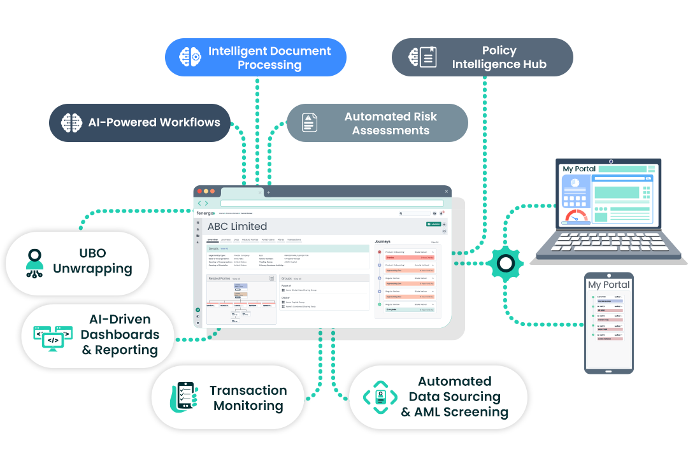

# Komplieye - Unified Audit & Compliance Platform



## Overview

Komplieye is a comprehensive Audit Management System (AMS) and Compliance Management System (CMS) specifically designed for banks and NBFCs in India. Our platform combines cutting-edge technology with deep industry expertise to streamline audit processes, ensure RBI compliance, and reduce operational risk.

## Key Features

### 🔍 Audit Management System (AMS)
- **Risk-Based Audit Planning**: Automated scheduling with conflict checks and priority-based assignments
- **End-to-End Workflow Automation**: Template-based checklists with real-time progress tracking
- **Collaboration & Review Process**: Streamlined approval workflows with reviewer dashboards
- **Comprehensive Reporting**: One-click report generation with trend analytics

### 🛡️ Compliance Management System (CMS)
- **Compliance Calendar & Scheduling**: Comprehensive calendar with automated reminders
- **AI-Powered Regulatory Analysis**: Automatic parsing of RBI circulars with actionable compliance controls
- **RBI Returns Management**: Pre-loaded RBI returns with automated submission workflows
- **Issue Management**: Powerful task management with automatic escalation alerts

### 🤖 Advanced AI Features
- **Intelligent Document Processing**: Advanced OCR and NLP for regulatory document analysis
- **Automated Risk Assessments**: Predictive modeling and scenario analysis
- **Policy Intelligence Hub**: Centralized policy management with version control
- **Real-Time Monitoring**: Continuous compliance monitoring across all branches

## Technology Stack

- **Frontend**: HTML5, CSS3, Bootstrap 5, JavaScript
- **Styling**: Custom CSS with responsive design
- **Libraries**: 
  - Font Awesome for icons
  - Animate.css for animations
  - Owl Carousel for interactive elements
  - Lightbox for image galleries

## Installation & Setup

1. Clone or download the repository
2. Ensure you have Python 3 installed
3. Navigate to the project directory
4. Run the following command to start the local server:

```bash
python3 -m http.server 5000
```

5. Open your browser and navigate to `http://localhost:5000`

## Project Structure

```
komplieye/
├── css/
│   ├── bootstrap.min.css
│   └── style.css
├── img/
│   ├── carousel-1.jpg
│   ├── service-*.jpg
│   └── [other images]
├── js/
│   └── main.js
├── lib/
│   ├── animate/
│   ├── owlcarousel/
│   └── [other libraries]
├── attached_assets/
│   └── [platform images and documents]
├── index.html
├── about.html
├── service.html
├── project.html
├── use-cases.html
├── contact.html
└── [other HTML files]
```

## Key Pages

- **Home (`index.html`)**: Main landing page with overview of services
- **About (`about.html`)**: Company information and team details
- **Solutions (`service.html`)**: Detailed service offerings
- **Features (`project.html`)**: Platform features and capabilities
- **Use Cases (`use-cases.html`)**: Real-world implementation scenarios
- **Contact (`contact.html`)**: Contact information and demo requests

## Features Highlights

### Responsive Design
- Mobile-first approach with responsive breakpoints
- Optimized for desktop, tablet, and mobile devices
- Touch-friendly navigation and interactive elements

### SEO Optimized
- Semantic HTML structure
- Meta tags for search engine optimization
- Fast loading times and optimized images

### Accessibility
- WCAG compliance considerations
- Keyboard navigation support
- Screen reader friendly content

## Browser Support

- Chrome (latest)
- Firefox (latest)
- Safari (latest)
- Edge (latest)
- Internet Explorer 11+

## Contact Information

**Kalolytic Solutions Pvt. Ltd.**
- 📍 Location: Noida, India
- 📧 Email: sanjay.yadav@kalolytic.com
- 📧 Support: info@komplieye.com
- 📞 Phone: +91-9876543210

## Social Links

- [LinkedIn](https://linkedin.com/company/komplieye)
- [Twitter](https://twitter.com/komplieye)
- [YouTube](https://youtube.com/komplieye)
- [Company Website](https://kalolytic.com)

## License

© 2025 Kalolytic Solutions Pvt. Ltd. All rights reserved.

## Security & Compliance

- **ISO 27001:2013 Certified**
- **CERT-In Compliant**
- **GDPR Ready**
- Enterprise-grade security with encryption and access control

## Support

For technical support or demo requests, please contact:
- Email: sanjay.yadav@kalolytic.com
- Phone: +91-9876543210

---

*Built specifically for Indian financial institutions with pre-configured RBI compliance frameworks and industry best practices.*